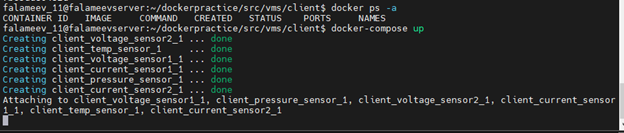
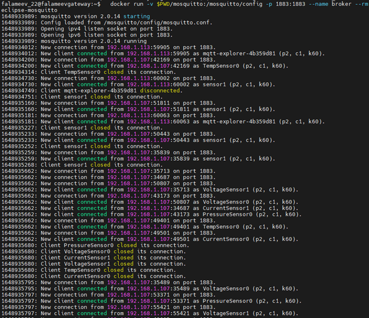
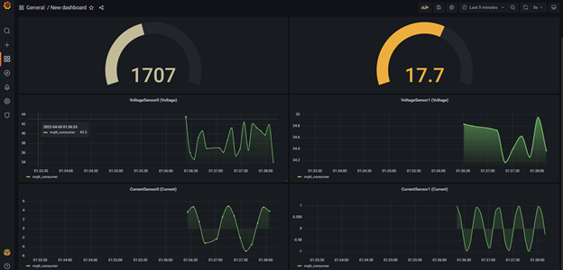

# Инструкция:

# Linux A (client)

Директорию client со всем содержимым следует перенсти на машину:

Если хотим сконфигурировать кастомные датчики, то нужно запуллить образ, созданный мной.
```shell
sudo docker pull egordockerhub/dockerpractise:sensors_v2
```
Для конфигурации контейнера следует ввести следующую команду, где MQTT_HOST=IP вашего mqtt брокера:
```shell
docker run --rm -e TYPE=pressure -e MQTT_HOST=192.168.1.106 -e MQTT_PERIOD=5 -e COEFFICIENT=1 egordockerhub/dockerpractise:sensors_v2
```
Иначе можно организовать запуск заведомо сконфигурированных контейнеров через docker-compose. Для этого необходимо запустить docker-compose.yml:
```shell
sudo docker-compose up
```
При работа с docker-compose следует указать MQTT_HOST=IP вашего mqtt брокера, а также прописать желаемые параметры датчиков.
Лог машины: 



# Linux B (gateway)

Директорию gateway со всем содержимым следует перенсти на машину:

Необходимо на данной машине настроить mqtt брокер. Для этого необходимо запуллить образ eclipse-mosquitto:
```shell
sudo docker pull eclipse-mosquitto
```
Далее следует запустить брокер на порту 1883, установить volume - mosquitto.conf с заранее заданными прараметрами.
```shell
docker run -v $PWD/mosquitto:/mosquitto/config -p 1883:1883 --name broker --rm eclipse-mosquitto
```
Лог машины при запуске брокера: 



# Linux C (server)

Директорию server со всем содержимым следует перенсти на машину:

1. Настройка telegraf:

В конфигурациионо файле следует заменить следующую строку:
```shell
# в блок mqtt_consumer
servers = ["tcp://IP адрес вашего брокера"]
```

2. Запуск docker-compose:

Для работы необходимо зпустить docker-compose файл:
```shell
sudo docker-compose up
```
Данный файл содержить конфигурацию для корректной работы контейнеров influx, telegraf и grafana. В рамках данной мащины с помощью файла docker-compose сконфигурирована сеть. 

Полученные графики с помощью grafana:


